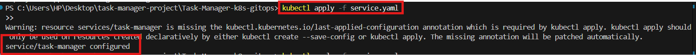
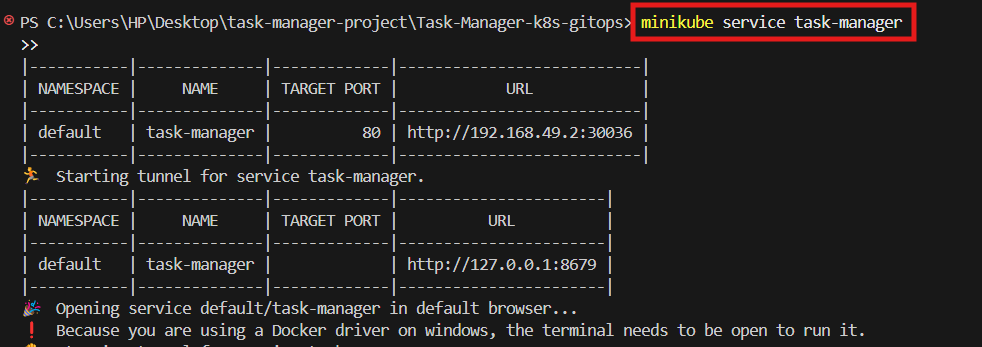

# React Task Manager App 🚀 | Everyday DevOps Series – Day 20+

This project kicks off a new phase of the **Everyday DevOps Challenge**, where we explore hands-on implementations of GitOps, containerization, observability, CI/CD, and security—one day at a time. The focus here is a lightweight yet production-ready **React Task Manager** application, which we will iteratively evolve through this DevOps series.

---

## 📌 Project Overview

This is a simple task manager web app built with **React**, styled using **Tailwind CSS**, and enhanced with **Lucide icons**. The app is containerized using Docker and served with **Nginx**, ready for production deployment in cloud-native or Kubernetes environments.

> ✅ This is **Day 20** of the Everyday DevOps series — our starting point for a fully GitOps-ready application pipeline.

## ⚙️ Tech Stack

- **Frontend:** React + Tailwind CSS + Lucide Icons
- **Containerization:** Docker (multi-stage build)
- **Web Server:** Nginx
- **Ready For:** CI/CD · GitOps · Kubernetes · Observability

---

## 📁 Project Structure

```bash
react-task-manager/
├── public/
│   └── index.html
├── src/
│   └── App.js
│   └── App.css
├── Dockerfile
├── nginx.conf
├── package.json
├── tailwind.config.js
├── postcss.config.js
└── README.md
```

## 🚀 Getting Started

### Prerequisites

- [Node.js](https://nodejs.org/) (v18+ recommended)
- [npm](https://www.npmjs.com/)
- [Docker](https://www.docker.com/)

### Installing Node.js & npm

To run the React app, you need Node.js and npm installed. If you don't have them yet, follow these instructions:

**npm is included with your Node.js installation. Choose your operating system below to install both.**

macOS (using Homebrew):

```bash
brew install node
```

Windows (using Chocolatey):

```bash
choco install nodejs-lts
```

Ubuntu/Debian:

```bash
curl -fsSL https://deb.nodesource.com/setup_lts.x | sudo -E bash -
sudo apt-get install -y nodejs
```

### 1️⃣ Project Files

- Replace the content of the following files with the code below.

```bash
public/index.html
```

- This is the main HTML file where your React app will be mounted. Ensure it has a `<div id="root"></div>`.

```html
<!DOCTYPE html>
<html lang="en">
  <head>
    <meta charset="utf-8" />
    <link rel="icon" href="%PUBLIC_URL%/favicon.ico" />
    <meta name="viewport" content="width=device-width, initial-scale=1" />
    <meta name="theme-color" content="#000000" />
    <meta
      name="description"
      content="Web site created using create-react-app"
    />
    <link rel="apple-touch-icon" href="%PUBLIC_URL%/logo192.png" />
    <link rel="manifest" href="%PUBLIC_URL%/manifest.json" />
    <title>React Task Manager</title>
  </head>
  <body>
    <noscript>You need to enable JavaScript to run this app.</noscript>
    <div id="root"></div>
  </body>
</html>
```

```bash
src/App.js
```

- This is the core logic and UI for the task manager.

```javascript
import React, { useState } from 'react';
import { Trash2, CheckCircle2, Circle } from 'lucide-react';
import './App.css'; // Assuming App.css will be used for any custom CSS if needed

const App = () => {
  const [tasks, setTasks] = useState([
    { id: 1, text: 'Plan the DevOps challenge articles', completed: true },
    { id: 2, text: 'Review project READMEs', completed: false },
    { id: 3, text: 'Prepare for Day 20 content', completed: false },
  ]);
  const [newTaskText, setNewTaskText] = useState('');

  const addTask = (e) => {
    e.preventDefault();
    if (newTaskText.trim() === '') return;
    const newId = tasks.length > 0 ? Math.max(...tasks.map(task => task.id)) + 1 : 1;
    const newTask = { id: newId, text: newTaskText.trim(), completed: false };
    setTasks([...tasks, newTask]);
    setNewTaskText('');
  };

  const toggleComplete = (id) => {
    setTasks(tasks.map(task => task.id === id ? { ...task, completed: !task.completed } : task));
  };

  const deleteTask = (id) => {
    setTasks(tasks.filter(task => task.id !== id));
  };

  return (
    <div className="min-h-screen bg-gray-100 p-8 flex flex-col items-center font-sans">
      <div className="bg-white shadow-xl rounded-2xl p-8 max-w-lg w-full">
        <h1 className="text-4xl font-bold text-center text-gray-800 mb-6">Task Manager</h1>
        
        <form onSubmit={addTask} className="flex gap-2 mb-8">
          <input
            type="text"
            value={newTaskText}
            onChange={(e) => setNewTaskText(e.target.value)}
            placeholder="Add a new task..."
            className="flex-grow p-3 border border-gray-300 rounded-lg focus:outline-none focus:ring-2 focus:ring-blue-500 transition-shadow"
          />
          <button
            type="submit"
            className="px-6 py-3 bg-blue-600 text-white font-semibold rounded-lg hover:bg-blue-700 transition-colors shadow-md"
          >
            Add Task
          </button>
        </form>

        <div className="space-y-4">
          {tasks.length > 0 ? (
            tasks.map(task => (
              <div key={task.id} className="flex items-center justify-between p-4 bg-gray-50 rounded-lg shadow-sm">
                <div className="flex items-center gap-4 flex-grow">
                  <button onClick={() => toggleComplete(task.id)} aria-label="Toggle task completion">
                    {task.completed ? (<CheckCircle2 className="text-green-500 h-6 w-6" />) : (<Circle className="text-gray-400 h-6 w-6" />)}
                  </button>
                  <span className={`text-lg flex-grow text-gray-700 ${task.completed ? 'line-through text-gray-400' : ''}`}>
                    {task.text}
                  </span>
                </div>
                <button
                  onClick={() => deleteTask(task.id)}
                  className="p-2 text-gray-400 hover:text-red-500 transition-colors"
                  aria-label="Delete task"
                >
                  <Trash2 className="h-5 w-5" />
                </button>
              </div>
            ))
          ) : (
            <p className="text-center text-gray-500 italic">No tasks yet. Add one above!</p>
          )}
        </div>
      </div>
    </div>
  );
};

export default App;
```

This is the core logic and UI for the task manager.

- The entry point of the app. Ensure it looks like this.

`src/index.js`

```javascript
import React from 'react';
import ReactDOM from 'react-dom/client';
import './index.css'; // This imports your Tailwind CSS
import App from './App';

const root = ReactDOM.createRoot(document.getElementById('root'));
root.render(
  <React.StrictMode>
    <App />
  </React.StrictMode>
);
```

`src/App.css`

- Create this file if it doesn't exist, or leave it empty. We're primarily using Tailwind for styling, so this file might not be strictly necessary unless you have custom CSS not handled by Tailwind.

```css
/* src/App.css */
/* Any custom CSS for your App component can go here */
```

`src/index.css`

- This file imports Tailwind CSS to be used in the app.

```css
@tailwind base;
@tailwind components;
@tailwind utilities;
```

`tailwind.config.js`

- This file configures Tailwind CSS to scan your source files for classes.

```js
/** @type {import('tailwindcss').Config} */
module.exports = {
  content: [
    "./src/**/*.{js,jsx,ts,tsx}",
  ],
  theme: {
    extend: {},
  },
  plugins: [],
}
```

`package.json`

- This file lists the dependencies for your React application and defines scripts.

```json
{
  "name": "react-task-manager",
  "version": "0.1.0",
  "private": true,
  "dependencies": {
    "react": "^18.2.0",
    "react-dom": "^18.2.0",
    "react-scripts": "5.0.1",
    "tailwindcss": "^3.3.3",
    "lucide-react": "^0.284.0",
    "autoprefixer": "^10.4.16",
    "postcss": "^8.4.31"
  },
  "scripts": {
    "start": "react-scripts start",
    "build": "react-scripts build",
    "test": "react-scripts test",
    "eject": "react-scripts eject"
  },
  "eslintConfig": {
    "extends": [
      "react-app",
      "react-app/jest"
    ]
  },
  "browserslist": {
    "production": [
      ">0.2%",
      "not dead",
      "not op_mini all"
    ],
    "development": [
      "last 1 chrome version",
      "last 1 firefox version",
      "last 1 safari version"
    ]
  }
}
```

### 2️⃣ Clone and Setup the App

- Create a repo on GitHub and clone repo toyour local environment
- Replace `<your-username>` and `<repo-name>` with your GitHub username and the name of your repository.

```bash
git clone https://github.com/<your-username>/<repo-name>.git
cd <repo-name>
npx tailwindcss init -p
npm install
npm start
```

- Run the following commands if you encounter any errors with npm.
- First make sure you're in the right project directory.

```bash
 npm start
 npm install
 npm audit fix --force   #To take care of any vlnerabilities
 npm run             #to check if the scripts are available
```

`npm run`


- Start by:

```bash
rm -rf node_modules package-lock.json    #to delete the ode_modules package-lock.json 
npm install       #to re-install the  node_modules package-lock.json
npm run
npm start
```


Access the app at [http://localhost:3000](http://localhost:3000)


---

## 🐳 Containerizing the App (Production Build)

### 3️⃣ Build the Docker Image

- Create or update the `Dockerfile` in the root:

```dockerfile
# Stage 1: Build React app
FROM node:18 AS builder

WORKDIR /app

COPY package*.json ./
RUN npm install

COPY . .
RUN npm run build

# Stage 2: Serve with Nginx
FROM nginx:alpine

# Copy custom Nginx config
COPY nginx.conf /etc/nginx/conf.d/default.conf

# Copy React build output to Nginx public directory
COPY --from=builder /app/build /usr/share/nginx/html

EXPOSE 80
CMD ["nginx", "-g", "daemon off;"]
```

- Create `nginx.conf` in the project root:

```nginx
server {
  listen 80;
  server_name localhost;

  root /usr/share/nginx/html;
  index index.html;

  location / {
    try_files $uri /index.html;
  }

  error_page 404 /index.html;
}
```

- Build & Run the Container Locally

```bash
docker build -t task-manager-app .
```


### 4️⃣ Run the Container

```bash
docker run -p 8080:80 task-manager-app
```

Visit [http://localhost:8085](http://localhost:8085) to view the live app.


---

## 🧠 What You’ll Learn in This Series

As we progress through the series, this project will serve as the base for exploring:

- 🔁 GitOps workflows (Flux CD, Argo CD)
- 🔍 Observability tools (Prometheus, Grafana, Loki)
- 🔐 DevSecOps integrations (Snyk, Trivy, Aqua)
- ⚙️ CI/CD pipelines (GitHub Actions, Jenkins, GitLab CI)
- ☁️ Kubernetes Deployments (with Helm/Kustomize)
- 📦 Docker image hardening and registry automation
- 📈 Metrics, logs, and alerts for frontend apps

---

## 📅 Progress Tracker: Everyday DevOps

| Day | Topic                                         |
|-----|-----------------------------------------------|
| 21  | 🟢 React App Setup + Dockerized              |
| 22+ | 🔜 GitOps, Monitoring, Security, CI/CD, etc. |

---

## Day 22 – Everyday DevOps Challenge 🚀

## PART-2: CI/CD with GitHub Actions for React Task Manager App

This guide will walk you through setting up a CI/CD pipeline using GitHub Actions to automatically build, containerize, and optionally push your React app to Docker Hub. It's beginner-friendly, no prior experience needed!

---

## 🛠 Prerequisites

✅ A GitHub repo with your React Task Manager app  
✅ Dockerfile already working locally  
✅ Docker Hub account

---

## 📁 PART 2 - Project Structure

```bash
react-task-manager/
├── public/
├── src/
├── Dockerfile
├── nginx.conf
├── package.json
├── .github/
│   └── workflows/
│       └── docker-build.yml
└── README.md
```

---

## 1️⃣ Step 1: Create GitHub Actions Workflow

📄 Path: `.github/workflows/docker-build.yml`


```yaml
name: Build and Dockerize React App

on:
  push:
    branches:
      - main

jobs:
  build:
    runs-on: ubuntu-latest

    steps:
    - name: Checkout code
      uses: actions/checkout@v3

    - name: Set up Node.js
      uses: actions/setup-node@v4
      with:
        node-version: 18

    - name: Install dependencies
      run: npm ci

    - name: Build the React app
      run: npm run build

    - name: Set up Docker
      uses: docker/setup-buildx-action@v3

    - name: Log in to Docker Hub
      uses: docker/login-action@v3
      with:
        username: ${{ secrets.DOCKER_USERNAME }}
        password: ${{ secrets.DOCKER_PASSWORD }}

    - name: Build and push Docker image
      uses: docker/build-push-action@v5
      with:
        context: .
        push: true
        tags: ${{ secrets.DOCKER_USERNAME }}/task-manager-app:latest
```

---

## 2️⃣ Step 2: Add GitHub Secrets

Go to your GitHub repo → Settings → Secrets and variables → Actions → **New repository secret**

Add:

- `DOCKER_USERNAME` → your Docker Hub username
- `DOCKER_PASSWORD` → your Docker Hub password or token(more secure)


---

## 3️⃣ Step 3: Test Your Workflow

✅ Git add, commit and push to the `main` branch  
✅ Watch the Actions tab for your build to run


✅ Make a small change to your `README.md` or any file if there is a build fail


If successful, your Docker image will be available on Docker Hub!


---

## 💡 Troubleshooting Tips

- Make sure `Dockerfile` is at the root of your repo
- Ensure your app builds successfully locally (`npm run build`)
- If your image isn't showing up, double-check your Docker tag or secrets
- Also make sure the naming of the secret matches the one in the local file.

---

## 🚀 Next Steps

In the next stage, we’ll prepare Kubernetes deployment configs so this containerized app can run in a real cluster!

---

## Day 23 - Deploy React App on Minikube (Kubernetes Made Simple)

Welcome to Day 23 of the Everyday DevOps Challenge! Today we’re going to deploy our Dockerized React Task Manager app to a **Kubernetes cluster running on Minikube**.

This guide is so simple even a curious 5-year-old could follow it 🚀

---

### 🧰 Prerequisites

Make sure these are installed and running:

- ✅ [Docker](https://docs.docker.com/get-docker/)
- ✅ [Minikube](https://minikube.sigs.k8s.io/docs/start/)
- ✅ [kubectl](https://kubernetes.io/docs/tasks/tools/)
- ✅ A Docker image already pushed to Docker Hub  
  Example: `your-dockerhub-username/task-manager-app:latest`

---

### 🚀 Step-by-Step Guide

#### 1. Start Minikube

- Run below command to start

```bash
minikube start
minikube -p minikube docker-env --shell powershell | Invoke-Expression  #Point Docker to Minikube
```

> ☕ This may take a minute. Minikube spins up a tiny Kubernetes cluster on your machine.


---

#### 2. Build Your Docker Image (Optional if already built)

```bash
docker build -t task-manager-app .
docker images
```

> ☕ This builds your React app into a Docker image named `task-manager-app`.


---

#### 3. Create Kubernetes Deployment

- Create a file called `deployment.yaml`:

```yaml
apiVersion: apps/v1
kind: Deployment
metadata:
  name: task-manager
spec:
  replicas: 1
  selector:
    matchLabels:clear
    
      app: task-manager
  template:
    metadata:
      labels:
        app: task-manager
    spec:
      containers:
      - name: task-manager
        image: task-manager-app
        ports:
        - containerPort: 80
```


- Create a `service.yaml` file

```bash
apiVersion: v1
kind: Service
metadata:
  name: task-manager
spec:
  selector:
    app: task-manager
  ports:
    - protocol: TCP
      port: 80
      targetPort: 80
  type: NodePort
```

- Apply it:

```bash
kubectl apply -f deployment.yaml
kubectl apply -f service.yaml
```




---

#### 4. Verify Deployment

- Check to see if deployments were applied

```bash
kubectl get deployments
kubectl get pods
```


---

#### 5. Access the App

```bash
minikube service task-manager
```



This opens your browser with the app running on Kubernetes 🎉


---

## Day 24 -🌍 Day 24 – Choosing a Cloud for GitOps ☁️🤯➡️🚀

Today’s challenge wasn’t writing YAML or deploying code, it was picking where to deploy it.

Big clouds like AWS, Azure, and GCP? Powerful but complex.

Smaller clouds like Civo, DigitalOcean, and Linode? Simpler, faster, and often easier on the wallet.

In the end, I realized it’s not about choosing the biggest cloud, it’s about choosing the right one for where you are in your journey.

If you’ve ever stared at multiple cloud provider tabs, wondering where to start, you’re not alone.

I broke down the pros, cons, and costs so you can skip the overwhelm and get to deploying faster.

Read the full article to join me on this part of my DevOps journey!
🔗 [https://lnkd.in/gAVANKdT](https://lnkd.in/gAVANKdT)

---

## Day 25 – Chasing “Free” Clouds: 4 Rejections, 0 Clusters… Still Smiling 😄

- Today’s hashtag#EverydayDevOps lesson wasn’t about YAML or pods, it was about cloud gatekeeping.

- I thought smaller “developer-friendly” clouds would be my ticket after ruling out the big three… but here’s how it went:
     1. Civo – Phone verification failed
     2. DigitalOcean – Address mismatch
     3. Linode – Flagged before launch (and $108/month for K8s)
     4. Oracle Cloud – Signup stalled

- I get it, verification protects against abuse, but for learners, it can feel like the hardest part of cloud computing is just getting in.

- The real cost of a cloud platform isn’t just money, it’s also the time, effort, and patience needed to get started.

- Well… I’m still smiling, so I ain’t giving up. 😄

Checkout post on [LinkedIn](https://www.linkedin.com/posts/rashida-mohammed-cloud_everydaydevops-kubernetes-devopsjourney-activity-7361357016017080321-w6Qd?utm_source=share&utm_medium=member_desktop&rcm=ACoAACwCcgABdkoA_oqBSidBRH7hgDtLW0chd50)

---

## 💫 Day 26 of hashtag#EverydayDevOps — The Prodigal Daughter Returns 💫

- After wandering through the “promised lands” of smaller cloud providers 🌴✨, chasing free credits and budget-friendly setups 💸, I’ve finally come back home… to the Big Three; AWS, Azure, and GCP.

Why?
 Well, let’s just say the journey was… educational 😂:
 💳 Billing roadblocks that made me question my life choices
 📍 Region limitations that cut my plans short
 🔌 Missing features that had me duct-taping solutions together

- Now, I’m ready to settle down 🏡, spin up my Kubernetes playground, and finally run Flux + ArgoCD together, all wrapped in a Terraform setup so I can build 🛠️ and destroy 💥 my pipeline with ease.

Sometimes, you have to roam far to appreciate what you had all along 😉.

📍 Full write-up: [https://lnkd.in/eA5fRJw8](https://lnkd.in/eA5fRJw8)

---

## Day 27 of hashtag#EverydayDevOps – Back to the AWS Cloud Castle 👑

- After wrestling with the limits of “free” cloud tiers, I’ve made peace with the fact that a reliable, managed Kubernetes setup isn’t truly free.

- So, I’m diving into AWS EKS and yes, it’s a paid playground, but one that unlocks powerful GitOps workflows with Flux and Argo CD.

- I’ll be sharing how I plan to keep things lean, spin environments up and down when needed, and turn past frustrations into real-world learning.

📖 Read my latest article: [https://lnkd.in/eCiXiiE8](https://lnkd.in/eCiXiiE8)

---

## Day 28/29 – Click ▶️, Ship 🚀: Deploy to AWS EKS (Super Simple Guide)

> Goal: Get your **Task Manager** app live on **AWS EKS** using Terraform + kubectl.  
> We keep it friendly, fast, and easy. Pinky promise. 🤝

---

### 🧰 What you need (once)

- An **AWS account** (billing enabled)
- **Terminal** (macOS/Linux or Windows WSL/PowerShell)
- **Installed**: [Terraform], [AWS CLI], [kubectl]
- Your Docker image pushed (e.g. `DOCKERHUB_USERNAME/task-manager-app:latest`)

💡 *Money tip:* EKS is not free. Create → test → **destroy** when done.

---

## 🗂️ Your project folders (quick check)

```bash
Task-Manager-Project/
├── k8s/
│   ├── deployment.yaml
│   └── service.yaml
├── scripts/
│   ├── deploy.sh
│   └── destroy.sh
└── terraform/
    ├── main.tf
    ├── variables.tf
    ├── outputs.tf
    ├── versions.tf
    └── terraform.tfvars.example
```

If you don’t see these, create them or copy from Day 26.


---

## Step 0 - Put your Docker image name in the app

Open `k8s/deployment.yaml` and replace the image placeholder:

```yaml
# k8s/deployment.yaml
containers:
  - name: task-manager
    image: DOCKERHUB_USERNAME/task-manager-app:latest   # <-- change this
```


- Also be aware that the `service.yaml` file would be different from the previous one. So replace it with below:

```yaml
apiVersion: v1
kind: Service
metadata:
  name: task-manager
  labels:
    app: task-manager
spec:
  type: LoadBalancer
  selector:
    app: task-manager
  ports:
    - port: 80
      targetPort: 80
```

---

## Step 1 - Log in to AWS (one-time)

- You first need to create an IAM user on the AWS console with below attached policies:

```bash
AmazonEKSClusterPolicy
AmazonEKSWorkerNodePolicy
AmazonEKS_CNI_Policy
AmazonEC2FullAccess
IAMFullAccess #(optional, for flexibility while testing)
AWSKeyManagementServicePowerUser
```

- Or create an inline policy with below script:

```bash
{
  "Version": "2012-10-17",
  "Statement": [
    {
      "Effect": "Allow",
      "Action": [
        "eks:*",
        "iam:CreateRole",
        "iam:AttachRolePolicy",
        "iam:PassRole",
        "iam:CreateServiceLinkedRole",
        "ec2:Describe*",
        "ec2:CreateSecurityGroup",
        "ec2:AuthorizeSecurityGroupIngress",
        "ec2:AuthorizeSecurityGroupEgress",
        "ec2:RevokeSecurityGroupEgress",
        "ec2:DeleteSecurityGroup",
        "kms:DescribeKey",
        "kms:CreateGrant",
        "kms:ListGrants",
        "kms:RevokeGrant"
      ],
      "Resource": "*"
    }
  ]
}
```

- Create an access key for the user and and use it to configure the CLI using below commands

```bash
aws configure
# Paste: AWS Access Key ID, Secret Access Key, region (e.g. us-east-1), output (json)
aws sts get-caller-identity
```

- You should see your AWS account info.


---

## Step 2 - Copy the example variables (easy button)

```bash
cd terraform
cp terraform.tfvars.example terraform.tfvars
```

- If you want, open `terraform.tfvars` and change region/cluster name.


---

## Step 3 - Create the cluster (the magic part ✨)

```bash
terraform init
terraform plan
terraform apply -auto-approve
```

This builds the VPC + EKS + nodes. Take a stretch break. 🧘‍♀️

- VPC Components


- EKS Components


## Step 4 - Point kubectl to your cluster

Update kubeconfig using the **eks-admin** profile:

```bash
aws eks update-kubeconfig --name everyday-devops-eks --region us-east-1 --profile everydaydevops
```

Check context:

```bash
kubectl config get-contexts
kubectl config current-context
```


---

## Step 5 - Grant the IAM user Kubernetes admin

- Kubernetes RBAC is separate from IAM. You must map the IAM user into `system:masters` via the `aws-auth` ConfigMap.

### Add Cluster-Wide Admin Policy (Console)

- Go to the Amazon EKS Console → Clusters → everyday-devops-eks

- In the Access tab, check for any existing Access entries.

- Click Manage access entries.

- Select the IAM principal `Everydaydevops`.


- Under Access policies, choose:

✅ AmazonEKSClusterAdminPolicy


- Scope: Cluster (not Namespace).

- Save changes.

## Step 6 - Test access

```bash
kubectl get nodes
kubectl get ns
```

- You should see your worker nodes and default namespaces.


---

## Step 7 - Deploy the app to Kubernetes

- From the **project root** run:

```bash
kubectl apply -f k8s/deployment.yaml
kubectl apply -f k8s/service.yaml
kubectl get pods
kubectl get svc task-manager -o wide
```

- Wait 1–3 minutes for the Service to get an **EXTERNAL-IP/hostname**.  

- Open it in the browser: `http://<EXTERNAL-IP>`

  


---

## Step 8 - Save money: Destroy when done 💸

```bash
# Optional: remove app first
kubectl delete -f k8s/

# Then destroy infra
cd terraform
terraform destroy -auto-approve
```

---

## ✅ You did it

- You built a real Kubernetes cluster on AWS.
- You deployed your app with 2 files (`deployment.yaml`, `service.yaml`).
- You learned to **create, verify, expose, and destroy**. Boom. 💥

---

### Appendix (optional)

- Want GitOps next? Add Flux or Argo CD with Helm later.

- Want HTTPS + custom domain? Use AWS ALB Ingress + ACM (future step).

## Day 30: GitOps with Flux CD on EKS (PowerShell)

### Objective

- Implement GitOps using Flux CD to manage the React Task Manager app on EKS. Changes to Git automatically update the Kubernetes cluster.

---

## Flux CD Prerequisites

- Running **EKS cluster**  
- **AWS CLI** configured (`aws configure`)  
- **kubectl** installed  
- **Flux CLI** installed (see Step 0 below)  
- Git repository with your Kubernetes manifests (`deployment.yaml` & `service.yaml`)

---

## Step 0: Install Flux CLI

- First run your powershell as an Administrator

```bash
# Download and install Flux CLI 
choco install flux 

# Verify installation
flux --version
```


---

## Step 1: Configure kubectl for EKS

```bash
aws eks --region <region> update-kubeconfig --name <cluster-name>
kubectl get nodes
```

- Ignore this if already done in previous configuration

---

## Step 2: Create Flux Namespace

- Create a new namespace for flux by running:

```bash
kubectl create namespace flux-system
```

---

## 👥 Contributing

This is a solo DevOps learning project for now, but contributions or ideas are welcome as I grow the scope of the challenge.

---

## 📄 License

MIT

---

## 🙋‍♀️ Author

**Rashida Mohammed** — Everyday DevOps Challenge | GitOps Series  
[LinkedIn](https://www.linkedin.com/in/rashida-mohammed-cloud) • [GitHub](https://github.com/Rashkerry-newversion)

---

## 🌐 Join the Journey

Follow the [Everyday DevOps Challenge](https://www.linkedin.com/in/rashida-mohammed-cloud) on LinkedIn for daily updates, lessons learned, and behind-the-scenes progress
